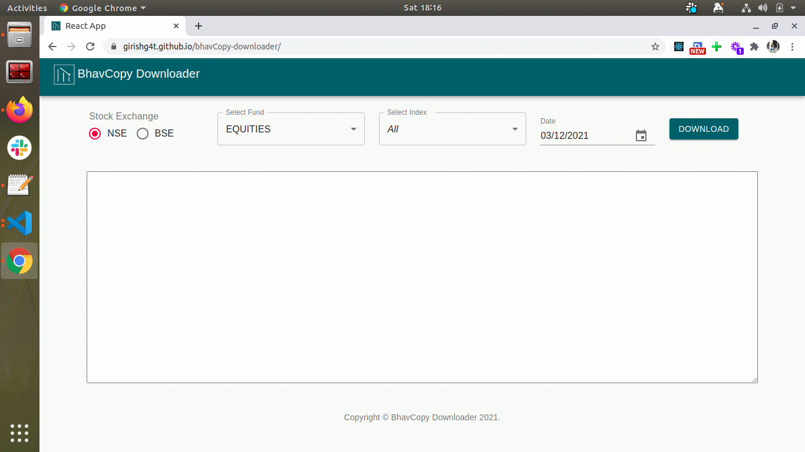
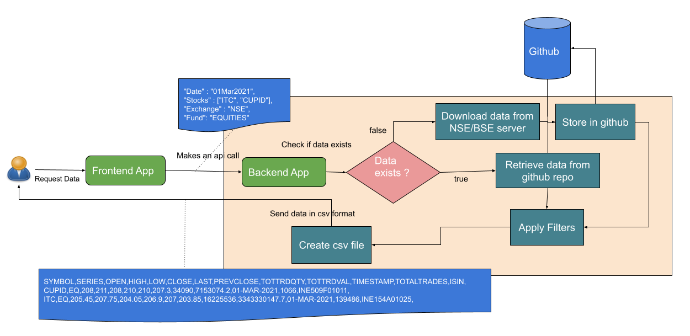

# Get free NSE & BSE data based on customizable index and date

### Why there is need for this:

For Technical analysis of stocks, for generating graphs and for many more such usecases most of the people requires `End of Day` stocks data called as Bhavcopy. I didn't find a place where i can get both Indian stock exchanges bhavcopy freely, hence the idea of creating a simple, customizable and public app, so that any one can download the NSE and BSE bhavcopy free.

### Simple solution to the problem:

I have created a public [website](https://girishg4t.github.io/bhavCopy-downloader/), below is the working of the same. BhavCopy-Downloader export data in csv format that is easily imported in leading technical analysis software. It connects to NSE and BSE servers to download this data, so it can be considered 100% authentic. I have made this highly customizable so that any one can update the index's as per there need and download the bhavcopy. Please check the contribution section for the same.

### Public Github repository of the project

I have create a public github repo called as  [BhavCopy-Downloader](https://github.com/girishg4t/bhavCopy-downloader) where all the source code of the current project is present. There are 2 folders called as nse and bse where all the stocks bhavcopy's are stored for a particular date. The bhavcopy stored so far is based on the request made by someone from the app, Other bhavcopy will be downloaded and stored as per request.

### Architecture of the project:

Created a flow diagram to get batter understand of the project 

### Details on how to use the application:

1. Select the Stock Exchange from which the data is required eg. NSE/BSE
2. Select Fund for the particular exchange, currently it is configured for Equity only, in future more options will be added
3. Select the Index for which the data is required default is All.
4. One's index is selected all the stock in that index get appear in textarea which is editable. User can make changes to the list.

    [Current configured indexes](Get%20free%20NSE%20&%20BSE%20data%20based%20on%20customizable%20inde%20e9fcfe4a9a964ca88dbc45914aa6236d/Current%20configured%20indexes%203b06726a808a4ba483f6a56b91c444c0.csv)

5. Select date, to download the specific day data, default is previous date.
6. Click on download to download the bhavcopy in csv format.

### Contribution is always welcome:

Since the [github repo](https://github.com/girishg4t/bhavCopy-downloader) is public any one can contribute. For keeping all the index up to date i require help, that's why i have made that highly customizable. 

All the index and stocks in that are stored in json files at "./src/NSEIndexConfigs" and "./src/BSEIndexConfigs". You can create new index, update the existing index based on NSE and BSE index change or add new one which i have missed. Create a pull request and submit the changes.

Also there is "./src/config.json" in which UI related config are present.

Inputs are always welcome! I want to make contributing to this project as easy and transparent as possible, whether it's:

- Reporting a bug
- Discussing the current state of the code
- Submitting a fix
- Proposing new features

### Feedback or comments

Tell me your openioun or thoughts on this, Wheather it is negative or postive doesn't matter. Together we can make this batter.